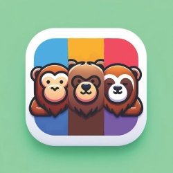

# EvryDay

## Description
An mobile app that combines the functionalities of three applications, all aimed at promoting a healthy lifestyle. Users can set various goals as part of a long-term health plan, such as logging daily activities, aiming for a 30% protein intake every day, working out daily, etc. The app features a "Healthy Score" out of 100, reflecting how much of their daily goal the user has achieved.

This multifaceted app will track calories and macros, monitor workouts (including sets, weights, and rest times used at the gym), and allow users to record their sleep duration and quality. By aggregating this data, the app employs a machine learning (ML) model to offer personalized suggestions. For example, if a user consistently exceeds their daily calorie limit, skips workouts for a week, and reports poor sleep quality, the app might recommend eating less, exercising more, or improving sleep habits.

To make the experience engaging, EvryDay introduce unique mascots for each section of the app, similar to Duolingo's approach. Aptly Ape will guide users through dieting, Buffy Bear will focus on workouts, and Snugly Sloth will cover sleep. These avatars will deliver ML-generated suggestions in a fun and creative manner.

## Authors and acknowledgment
This app was created with love by:
- Andy Duong
- Dominic Malouf
- Enzo Mendez
- Josh Routledge

as a CAPSTONE Project under the guidance of:
- Professor De St. Germain
- Professor Wang

